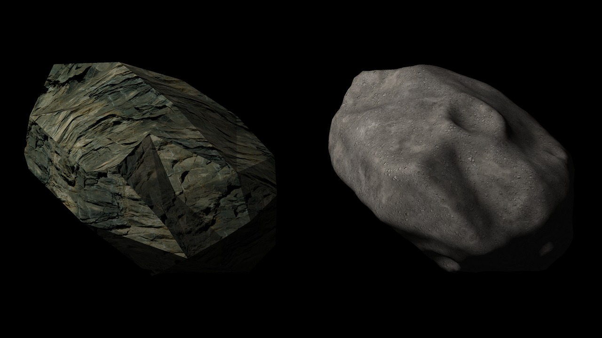

# HD Asteroids

A mod for *Nexus: The Jupiter Incident*.

Replaces all 35 asteroid models with high-poly versions and the two asteroid rock materials with 1024×1024 textures with surface relief.

The textures were generated with Nano Banana.

Original on the left, replacement on the right.

## Steam Workshop
[https://steamcommunity.com/sharedfiles/filedetails/?id=3801582318](https://steamcommunity.com/sharedfiles/filedetails/?id=3801582318)

## Manual Install (e.g. for GOG version)

Copy the repository contents into a new folder inside the game's `mods/` directory, then enable the mod in the game launcher.

## Licence

[CC0 1.0](LICENSE) — public domain. Reuse freely, commercially or otherwise, no attribution required. Contains no original game assets.
